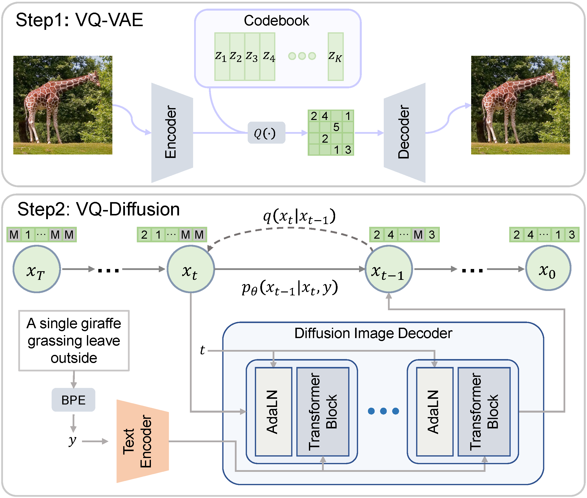

# Vector Quantized Diffusion Model for Text-to-Image Synthesis

## Overview

This is the official repo for the paper: [Vector Quantized Diffusion Model for Text-to-Image Synthesis].

> VQ-Diffusion is based on a VQ-VAE whose latent space is modeled by a conditional variant of the recently developed Denoising Diffusion Probabilistic Model (DDPM). It produces significantly better text-to-image generation results when compared with Autoregressive models with similar numbers of parameters. Compared with previous GAN-based methods, VQ-Diffusion can handle more complex scenes and improve the synthesized image quality by a large margin.

Our code and model is ready, however, they are still under the review of the company. We promise to release them in December.

## Framework

## Samples

